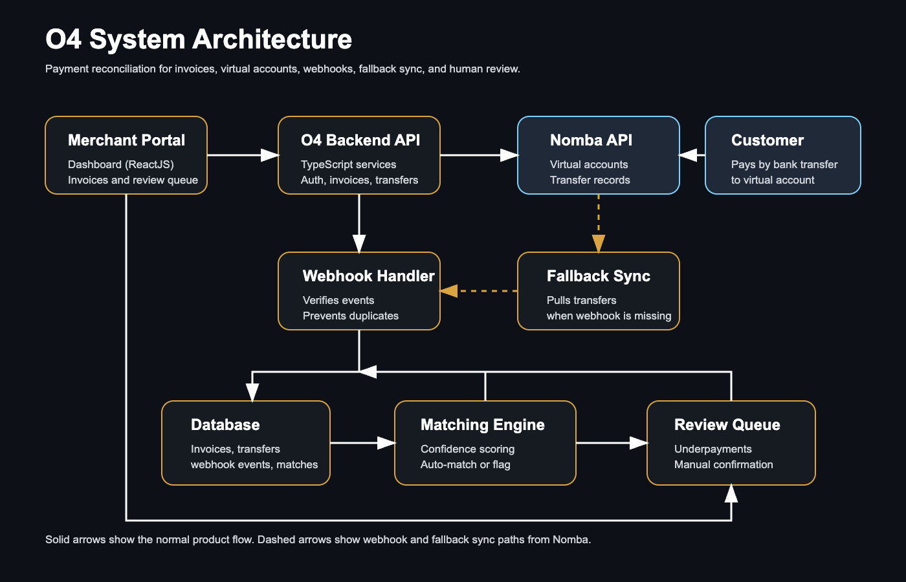

# O4 System Architecture

O4 is built around a backend API, a merchant portal, a relational database, Nomba virtual accounts, and a reconciliation engine.

## Core Components

- Merchant portal: the web app where businesses create invoices, review payments, and confirm flagged matches.
- Backend API: handles authentication, invoices, virtual accounts, transfers, webhooks, and reconciliation actions.
- Database: stores organizations, users, customers, invoices, virtual accounts, transfers, match results, webhook events, and trusted sender history.
- Nomba integration: provisions virtual accounts and receives or fetches transfer data.
- Matching engine: scores incoming transfers against expected payments and decides whether to auto-match or flag for review.

## Data Flow

1. A business creates an invoice or expected payment.
2. O4 associates the customer with a Nomba virtual account.
3. A customer sends a bank transfer to the virtual account.
4. Nomba sends a transfer webhook to the backend.
5. O4 stores the transfer and runs the matching engine.
6. High-confidence matches are reconciled automatically.
7. Low-confidence matches move into the review queue.
8. Manual review decisions improve future matching through trusted sender history.

## Design Principles

- Webhooks first, fallback sync second.
- Keep reconciliation explainable with confidence scores and reasons.
- Never force uncertain payments into paid status.
- Store raw payment events for auditability and debugging.
- Keep organizations isolated in a multi-tenant workspace model.

See also:

- [Payment Flow](./payment-flow.md)
- [Reconciliation Engine](./reconciliation-engine.md)
- [Technical Decisions](./technical-decisions.md)
- [Database Schema](./database-schema.md)

## Next

[Documentation Home](./README.md) | [Next: Payment Flow](./payment-flow.md)
