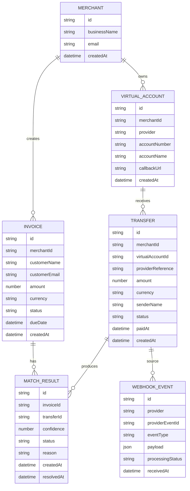

# O4 Database Schema

This is a suggested schema for the O4 reconciliation system.

## Entities



## Important Status Values

### Invoice Status

- `pending`
- `paid`
- `partially_paid`
- `flagged`
- `cancelled`

### Transfer Status

- `unmatched`
- `matched`
- `flagged`
- `ignored`

### Match Status

- `auto_confirmed`
- `needs_review`
- `confirmed`
- `rejected`

## Indexes to Add

```txt
invoices.merchantId
invoices.status
transfers.providerReference unique
transfers.virtualAccountId
transfers.status
match_results.invoiceId
match_results.transferId
webhook_events.providerEventId unique
```

## Why This Schema Works

- It separates invoices from transfers.
- It keeps raw webhook events for debugging.
- It supports duplicate webhook prevention.
- It allows many possible match attempts before final confirmation.
- It gives the review queue a clear data model.
