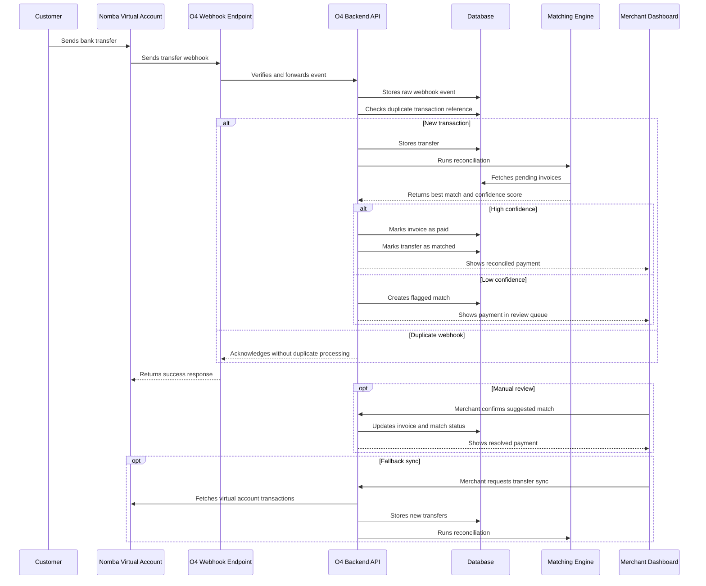

# O4 Payment Reconciliation Sequence Diagram

```mermaid
sequenceDiagram
    participant Customer
    participant Nomba as Nomba Virtual Account
    participant Webhook as O4 Webhook Endpoint
    participant API as O4 Backend API
    participant DB as Database
    participant Engine as Matching Engine
    participant Dashboard as Merchant Dashboard

    Customer->>Nomba: Sends bank transfer
    Nomba->>Webhook: Sends transfer webhook
    Webhook->>API: Verifies and forwards event
    API->>DB: Stores raw webhook event
    API->>DB: Checks duplicate transaction reference

    alt New transaction
        API->>DB: Stores transfer
        API->>Engine: Runs reconciliation
        Engine->>DB: Fetches pending invoices
        Engine-->>API: Returns best match and confidence score

        alt High confidence
            API->>DB: Marks invoice as paid
            API->>DB: Marks transfer as matched
            API-->>Dashboard: Shows reconciled payment
        else Low confidence
            API->>DB: Creates flagged match
            API-->>Dashboard: Shows payment in review queue
        end
    else Duplicate webhook
        API-->>Webhook: Acknowledges without duplicate processing
    end

    Webhook-->>Nomba: Returns success response

    opt Manual review
        Dashboard->>API: Merchant confirms suggested match
        API->>DB: Updates invoice and match status
        API-->>Dashboard: Shows resolved payment
    end

    opt Fallback sync
        Dashboard->>API: Merchant requests transfer sync
        API->>Nomba: Fetches virtual account transactions
        API->>DB: Stores new transfers
        API->>Engine: Runs reconciliation
    end
```
